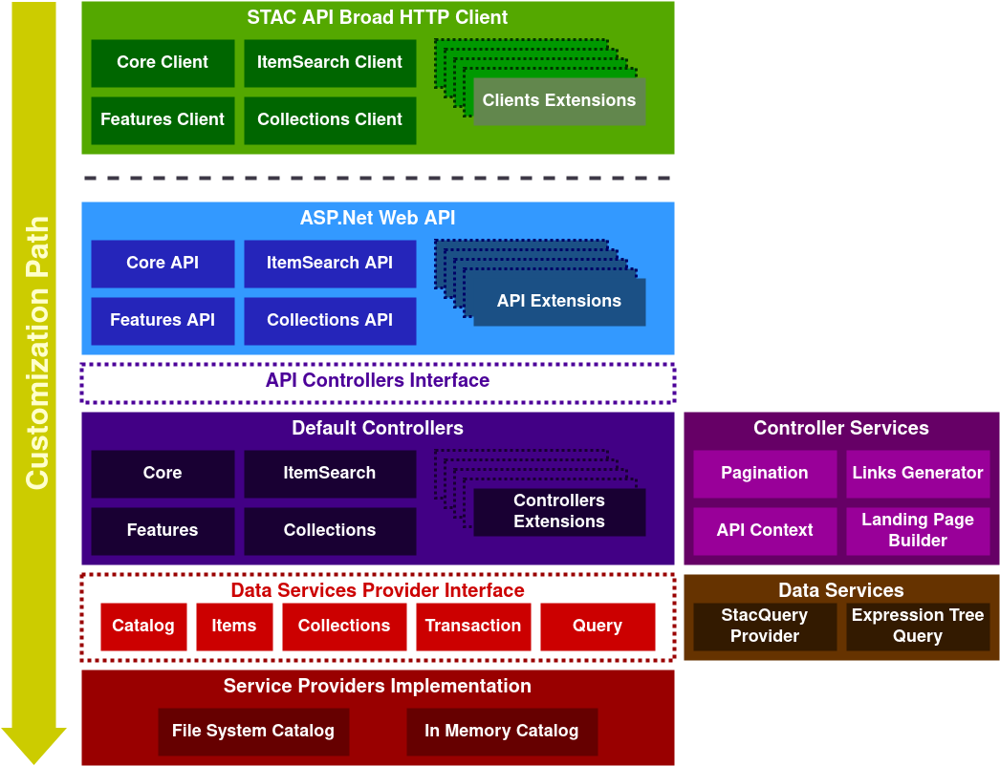

## DotNetStac.Api: The STAC API SDK for .NET, ASP.NET Core

DotNetStac.Api | [DotNetStac](https://github.com/Terradue/DotNetStac)

DotNetStac.Api is a Software Development Kit (SDK) for .NET and ASP.NET Core to build and query STAC API compliant services. It is based on the [STAC API specification](https://github.com/radiantearth/stac-api-spec) and uses the [DotNetStac library](https://github.com/Terradue/DotNetStac) for the [STAC data model](https://github.com/radiantearth/stac-spec).

The project combines Clients and Controllers code generation from the [STAC API specification](https://github.com/radiantearth/stac-api-spec) using [NSwag](https://github.com/RicoSuter/NSwag) (OpenAPI/Swagger generation). It allows several entry points for developers to use, build and customize STAC API compliant services.

The project is developed and maintained by [Emmanuel Mathot](https://github.com/emmanuelmathot) for [Terradue](https://github.com/Terradue).

**Features:**

- Access all STAC API endpoints from a single client or via specific clients
- Serve a full STAC API compliant service from a single app or via specific controllers
- Customize API controllers with specific business logic
- Implement your own STAC catalog data services and serve it with the default STAC API controllers
- Every layer can be extended and customized with additional services
- User the .NET queryable data model to query your STAC catalogs using expression tree

**Ways to use the SDK:**

- In your C# code, via [NuGet](https://www.nuget.org/packages?q=DotNetStac.Api) packages
- In [Stars](https://github.com/Terradue/Stars) CLI tool using the API commands
- Starting the docker image [Terradue/DotNetStac.Api](https://hub.docker.com/r/terradue/dotnetstac.api) with a file system or in memory catalog.

**Tutorials:**

- [Query STAC API compliant service with the client](notebooks/tutorial1.ipynb)
- [Integrate the STAC API controllers into your ASP.NET Web API project](docs/tutorials/integrate-stac-api-controllers-into-aspnet-web-api-project.ipynb)
- [Implement your own STAC data service provider and expose it via STAC API](docs/tutorials/implement-your-own-stac-data-service-provider-and-expose-it-via-stac-api.ipynb)