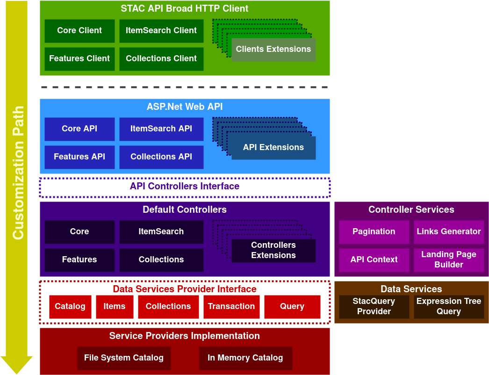

# Library Documentation

As described in the following diagram, the library is composed of several layers in 2 main blocks:

- The [STAC API Broad HTTP Clients](clients.md) that is a set of classes that implement the STAC API HTTP specification to access to all STAC API endpoints from a single client or via specific clients.
- The [STAC ASP.Net Web API](webapi.md) that is a set of classes that implement the STAC API HTTP specification to serve Serve a full STAC API compliant service from a single app or via specific controllers

